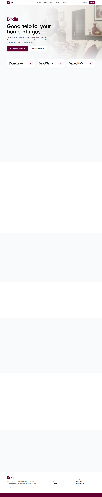
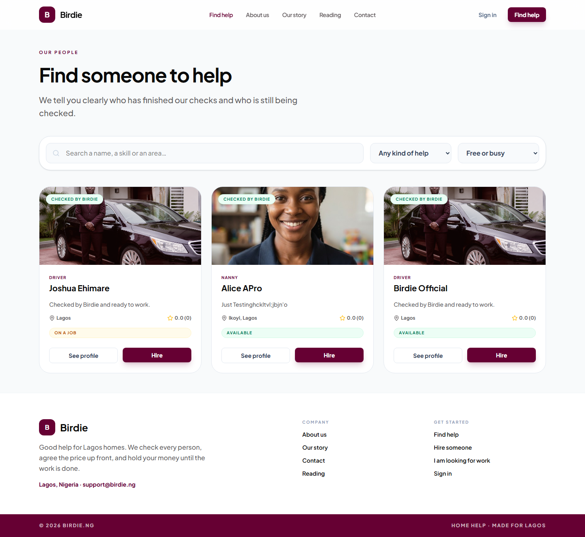
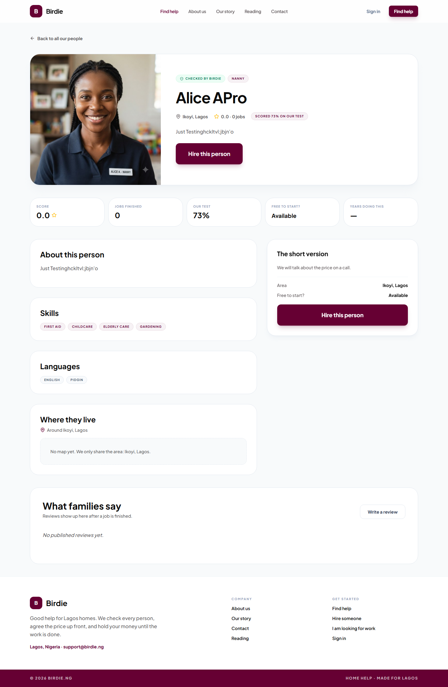
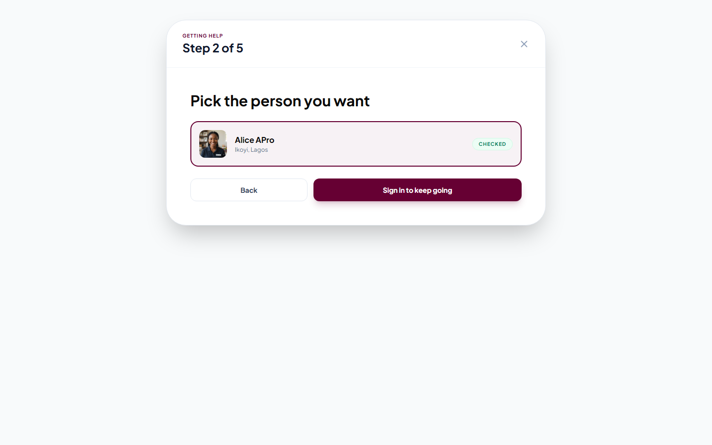
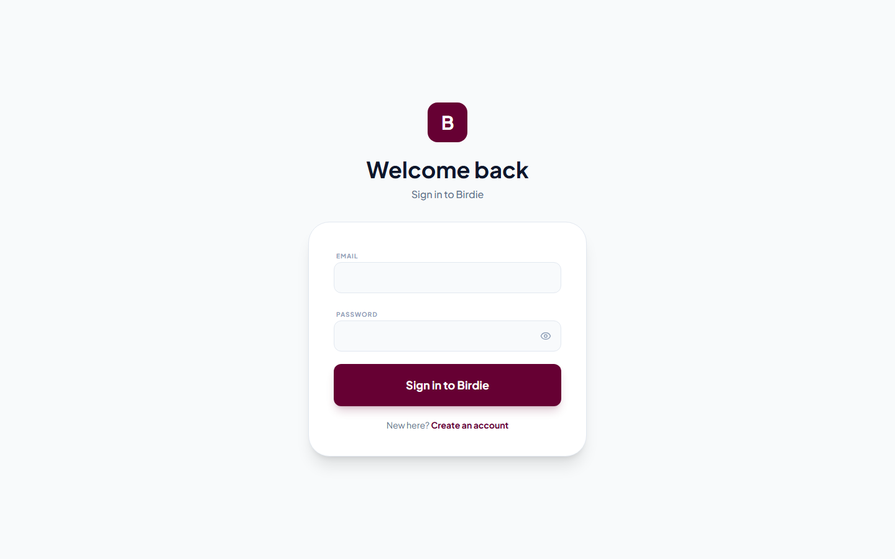
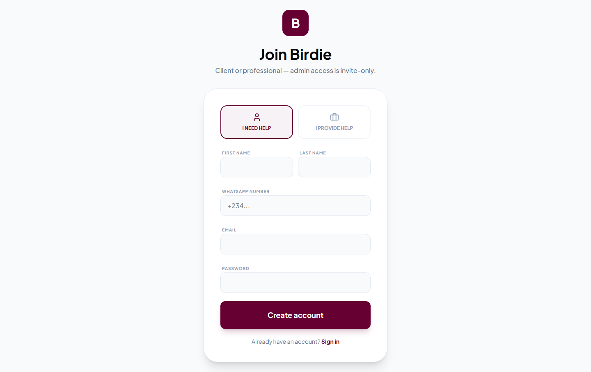
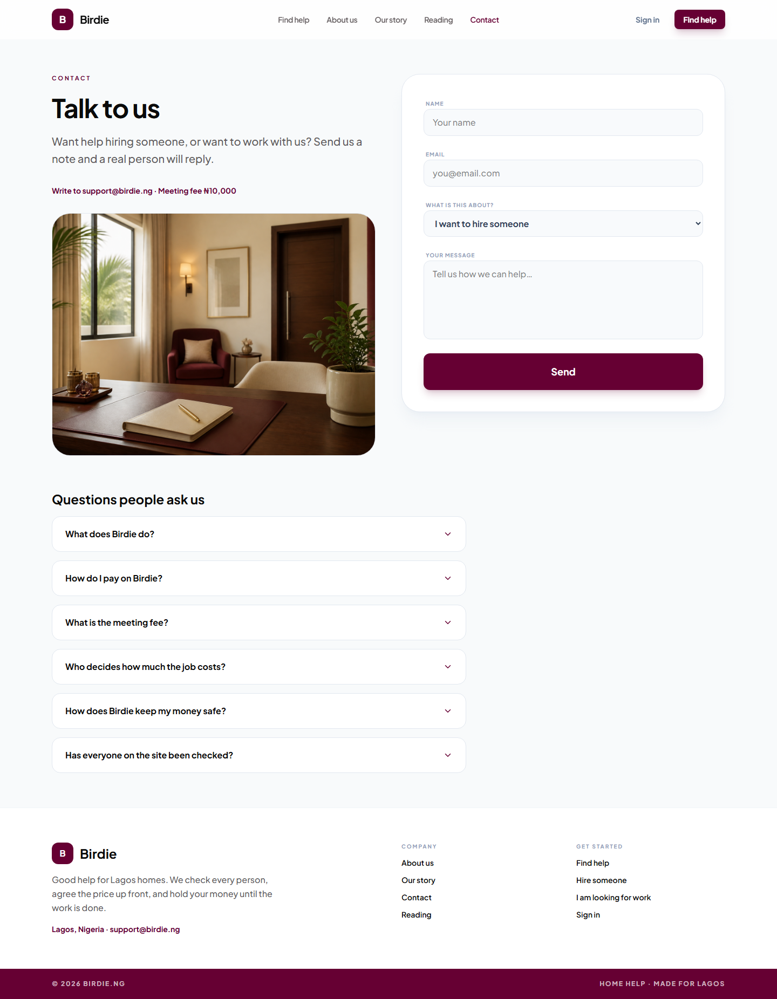

# Birdie QA report — hire and pay lifecycle

**Date:** 18 Aug 2026  
**App under test:** `http://localhost:3000` (Vite) talking to the live Birdie database  
**Paystack mode:** Test  
**Birdie fee:** 3.5%  
**Tester:** automated browser (public pages) + database check (money math)

This page is meant to be printed or saved as PDF. Screenshots sit next to each step.

---

## Verdict

The **public hire path and the money math work**.

I could not click the signed-in staff / family / professional dashboards. Those accounts exist (`admin@birdie.ng`, `joshuacl@birdie.ng`, `jcollehis@gmail.com`) but passwords are not in this project, and new sign-up requires email confirmation.

The last time you completed a real test hire on this database, the numbers were correct. That is stronger proof for “job done / pay professional” than a screenshot of a login box.

| Step | Result |
| --- | --- |
| Home, find people, open a profile | Pass |
| Hire wizard starts and asks for sign-in | Pass |
| `/app/hires` without a session sends you to login | Pass (security) |
| Register: family vs professional, admin is invite-only | Pass |
| Contact page shows support email and ₦10,000 meeting fee | Pass |
| Job done + pay professional on hire `BRD-260815-0002` | Pass (database) |
| 3.5% Birdie fee (₦2,450 of ₦70,000) | Pass |
| Professional ready to withdraw ₦67,550 | Pass |
| Withdrawal → Paystack transfer to a bank | **Not run** — no withdrawal requested yet, and no login |
| Full new hire with test card in this session | **Blocked** — need a signed-in family |

---

## Step 1 — Family lands on Birdie

Home loads. The family is told Birdie checks people and holds money until the job is done. **Find someone to help** is the main action.

**Opinion:** Keep this copy. Do not mention bank names or Paystack on the home hero.

---

## Step 2 — Family picks a person

Three checked people show. Hire buttons are visible.

**Issues (data, not code):**

- Alice’s bio is leftover test typing (`Just Testinghckltvl;jbjn'o`). Clean that before live.
- Joshua is **on a job** (old test hire `BRD-260811-0001` still active with ₦70,000 held). Finish or refund that hire so he is free again.
- Ratings are 0.0 because no published reviews yet. That is expected.

---

## Step 3 — Family reads the profile

Alice is checked, scored 73% on the test, available in Ikoyi. **Hire this person** is clear. Reviews are empty until a job is finished.

**Opinion:** Hide or rewrite dummy bios before families see the live site.

---

## Step 4 — Hire wizard, then sign-in wall

Step 2 of 5: pick Alice. Guest cannot send a request. Button: **Sign in to keep going**.

That button correctly opens login (with a return path to hire).

**Opinion:** This is the right security behaviour. Do not let guests create unpaid hires.

---

## Step 5 — Sign in / create account

Register offers **I need help** or **I provide help**. Copy says admin is invite-only. Password field and WhatsApp (+234) are present.

**Blocked here:** I did not create a throwaway family. Email confirmation is on, so a new account would not sign in without the inbox.

To finish this step yourself: sign in as the family (`joshuacl@birdie.ng` or `jcollehisjobs@gmail.com`), send a hire, pay the meeting fee with test card `4084 0840 8408 4081`.

---

## Step 6 — Contact (settings-driven)

Support email `support@birdie.ng` and meeting fee ₦10,000 show. FAQ includes “How do I pay” and “How does Birdie keep my money safe.”

---

## Step 7 — App without login

Opening `/app/hires` while logged out sends you to login. Staff and family money pages are not public.

---

## Step 8 — Money logic (already completed on this database)

Hire **BRD-260815-0002** (Client Demo → Alice APro, ₦70,000) is now **settled / released**. Ledger:

| What happened | Amount | Reference ending |
| --- | --- | --- |
| Family paid, Birdie held it | ₦70,000 | `…escrow…` |
| Job marked done — out of hold | ₦70,000 | `_hold_out` |
| Job marked done — waiting | ₦70,000 | `_waiting_in` |
| Paid out of waiting | ₦70,000 | `_waiting_out` |
| Birdie fee 3.5% | ₦2,450 | `_birdie_fee` |
| Ready for Alice | ₦67,550 | `_ready` |

Alice’s wallet now: held **0**, waiting **0**, ready **₦67,550**.

That is the bug we fixed (duplicate ledger references) working in production data.

**Still open:** no row in `withdrawal_requests`. The last mile (Paystack test transfer to a bank) has not been clicked yet. Alice should request ₦67,550 (above the ₦5,000 floor), then staff approve on Money.

---

## Security notes from this pass

- Hire submit and `/app/*` require a session. Good.
- Public register cannot create admin. Good.
- Paystack secrets are not in the browser. Card checkout is server-started. Good.
- I did not attempt a logged-in attack on other people’s hires in this run.

I did **not** do a full penetration test. This was a lifecycle QA.

---

## What you should do next

1. Sign in as family, staff, and Alice (three browsers).
2. Finish one **new** hire with the test card (meeting fee + bill).
3. Confirm Held equals the bill, not double.
4. Staff: start job → job done → pay professional. Ready = bill − 3.5%.
5. Alice: request withdrawal → staff approve. Check Paystack **Transfers** in test (no real bank credit).
6. Clean Alice’s bio and close Joshua’s leftover active hire.

Hand this file plus the folder `docs/qa-hire-lifecycle/` to anyone writing the PDF.
